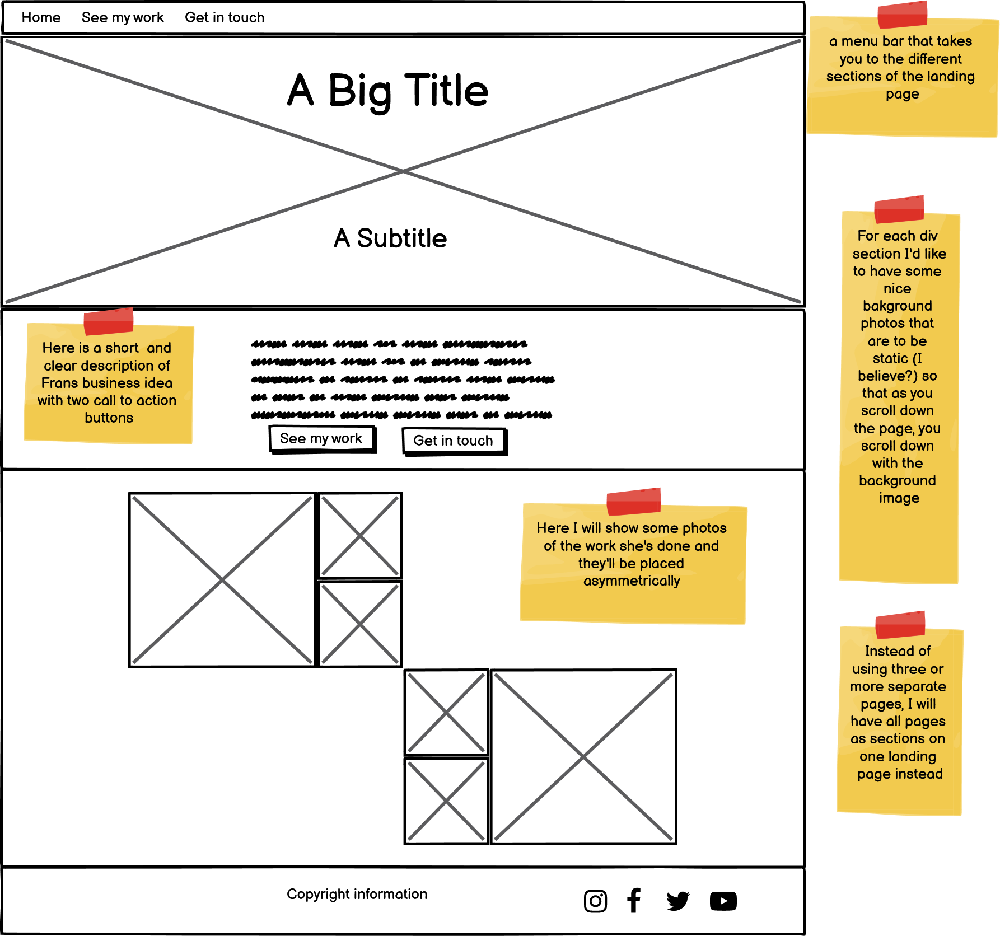
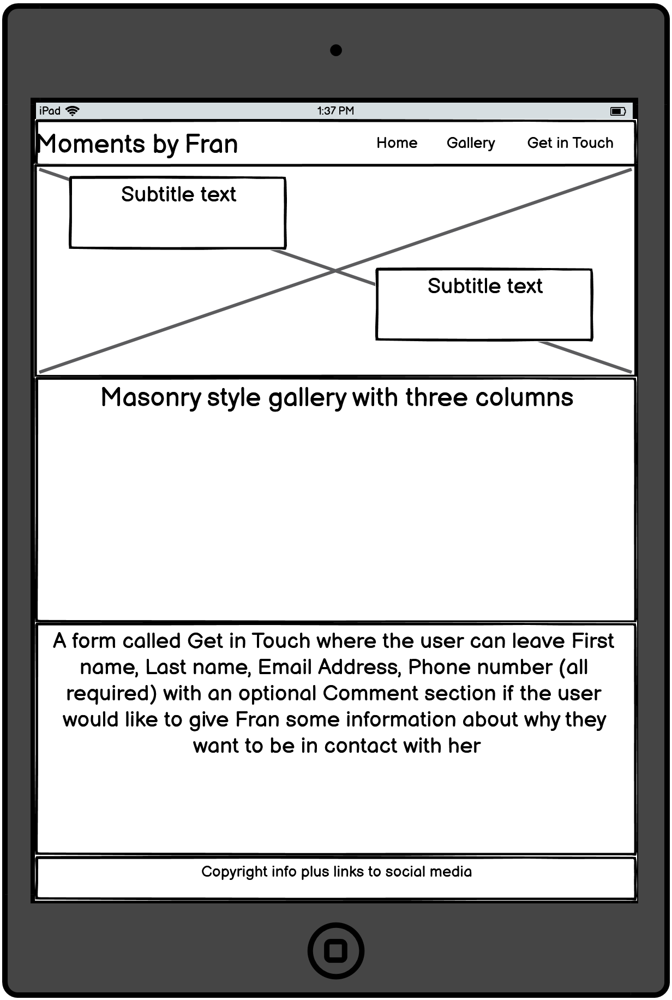

# Moments by Fran

This website aims to reach people who are looking for someone to help them create their special moment/day and make it memorable. 
Whether it is a gift for someones birthday or if it is the bouqeut for their wedding day that they would like to help with - this website will give them assurance that Fran is the person for the job.

Users who visit the site will know what Fran does, see what she has done in the past, and have a chance to get in contact with her if they are interested in her services.

## User stories

### Logo
- As a visiting user, I want to go to top of the page and therefore click on the logo that leads me there.

### Navbar
- Home
  - As a visiting user I want to go to top of the page and therefore click on the Home button.
- Gallery
  - As a visiting user I want to see the past work that Fran has done to help me decide if I want to work with her and therefore click on the Gallery button.
- Get in touch
  - As a visiting user I want to get in touch with Fran so I click on the Get in touch button that leads me to the form.

### Hero Image
- As a visiting user I want to know what this website is about so I expect the hero image and its subtitle text to provide me with the answer.

### Gallery
- As a visiting user I want to see the past work that Fran has done to help me decide if I want to work with her and therefore scroll through the gallery.

### Get in touch form
- As a visiting user I want to get in touch with Fran to get a quote for her work so I submit a form.

### /confirmed.html
- As a visiting user I want to know that my form submission was successfully submitted and therefore expect a confirmation message.

### Footer
- As a visiting user I want to keep in touch with Fran and follow her on social media platform and therefore expect to find links in the footer of the website that opens them in a new tab.

## Features

### __Existing features__

#### _Logo_
- The logo is a clickable link that will bring you back to index.html (or top of the page).

#### _Navigation Bar_
- The navigation bar is fixed and will follow along on top of the page as you scroll down the content. In this way there will always be a call to action with the user seeing the Get in Touch-button at all times.
- The navigation bar is built by using flex and will therefore work really nicely on smaller screen devices.

#### _Hero Image_
- The Hero Image gives a visual background of one of Frans handiworks as well as some subtitles that clearly describes what she does.

#### _Gallery_
- The gallery is built by using the popular masonry style. The content contains images of things that Fran has personally made, whether it is food arrangement, bridal bouquet or the images containing quotes from known people.

#### _Get in touch_
- This form is used as a call to action for the visitor and is placed right after the gallery section. By this time hope fully the user will have a hightened interest for Frans services and now we present them with an option to get in touch with her.
- Each line of the form will be required, except the comment section. This is optional and will give the user an opportunity to let Fran know beforehand what the user is interested in as Fran will reach out to the user.
- Once the user has filled out the form and clicks on the Submit button the user will get a confirmation on the page that the form submission was successful.

#### _Footer_
- The footer will contain important copyright information as well as links to social medias to stay in touch with Fran.
- This is important as most of the new content will be posted on her Instagram.

### __Future features__

Here are some the future features I will implement at a later stage. This is due to not having enough information at the moment, nor the skills, or that it would be too much time consuming at this stage of the project.

- Use Bootstrap for responsive navbar.
- Change logo to an actual image, the same as Fran has as a profile photo on Instagram (https://instagram.com/momentsbyfran).
- Remake the gallery and use and API from her Instagram so that each new post she makes gets automatically added. (I will also limit it to a maximum of 20 posts)
- Add more links to social media as they are made available.
- Perhaps make three, or more, separate pages as there's more content available. This is to reduce the amount of data that needs to be load each time you go to the webpage.
- Add a blog section where Fran gets to share stories of how moments she made different moments special and perhaps some behind the scenes content as well.

## Wireframes

## Typography and color scheme

### _Fonts_
- I used Amatic SC in cursive and Playfair Display as fonts

### _Color scheme_
- Color scheme was following: beige: #dbd5c9 grey: #393638 white: #fff black: #000